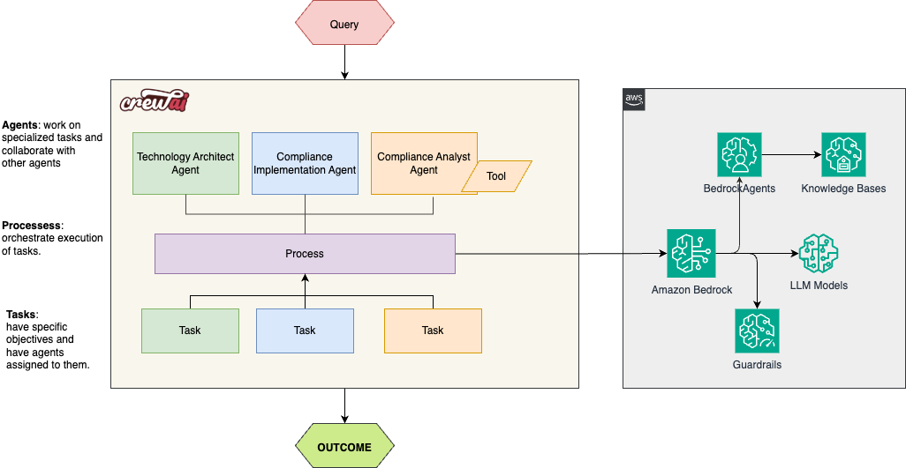

# sample-compliance-assistant-with-agents

### Automate Compliance With Bedrock and CrewAI

Welcome to the **sample-compliance-assistant-with-agents** project, powered by [Amazon Bedrock](https://aws.amazon.com/bedrock/) and [crewAI](https://crewai.com). This is a solution for automating some of the most tedious regulatory compliance processes using multi-agent AI systems. This solution serves as a practical starting point for organizations looking to enhance their compliance processes with AI capabilities, demonstrating how intelligent systems could complement and streamline existing compliance workflows. This solution’s architecture can be adapted to help healthcare systems, enable manufacturers to maintain ISO safety documentation, and assist retailers in monitoring FTC advertising regulations or in other segments such as legal, finance, or human resources, offering wide- ranging potential for process automation and efficiency gains across various industries.


## 📌 Table of Contents

- [sample-compliance-assistant-with-agents](#sample-compliance-assistant-with-agents)
    - [Automate Compliance With Bedrock and CrewAI](#automate-compliance-with-bedrock-and-crewai)
  - [📌 Table of Contents](#-table-of-contents)
  - [📚 Background Information](#-background-information)
  - [💻 Demo](#-demo)
  - [🎯 What This Solution Does](#-what-this-solution-does)
    - [Key Technologies Used](#key-technologies-used)
  - [📋 Prerequisites](#-prerequisites)
    - [AWS Account Requirements](#aws-account-requirements)
    - [Technical Requirements](#technical-requirements)
  - [🚀 Installation](#-installation)
    - [Step 1: Install CrewAI](#step-1-install-crewai)
    - [Step 2: Install Dependencies](#step-2-install-dependencies)
  - [⚙️ Customization](#️-customization)
    - [Define Your LLM.](#define-your-llm)
    - [Define your compliance challenge or Topic](#define-your-compliance-challenge-or-topic)
    - [Define your Bedrock Agent Details](#define-your-bedrock-agent-details)
    - [Configure Agents and Tasks](#configure-agents-and-tasks)
  - [🏃 Running the Project](#-running-the-project)
  - [🤖 Understanding Your Crew](#-understanding-your-crew)
  - [📋 Additional Documentation](#-additional-documentation)
  - [🤝 Contributing](#-contributing)
  - [📄 License](#-license)


## 📚 Background Information

Financial institutions operate in an environment where regulatory compliance is both critical and increasingly complex. Traditional approaches to managing compliance requirements—such as manual review of regulations, policy creation, and implementation of controls—are time-consuming, prone to human error, and struggle to keep pace with rapidly evolving regulatory landscapes. The solution sample-compliance-assistant-with-agents helps compliance teams to automate some of the most tedious activities such as Updating Policies and Standards based on changes in regulatory frameworks, implementing technical controls etc. This solution leverages generative AI and multi-agent systems to transform compliance management, offering:
- Automated regulatory monitoring
- Intelligent policy creation
- Streamlined control implementation
- Real-time compliance guidance

## 💻 Demo


## 🎯 What This Solution Does

This solution demonstrates how to build an intelligent, automated compliance management system that leverages multiple AI agents working in symphony to achieve defined outcomes. This patten can be leveraged to:

- ✅ Continuously monitor and analyze regulatory changes

- ✅ Transform regulatory requirements into organizational policies

- ✅ Design and implement technical controls

- ✅ Maintain compliance documentation

- ✅ Provide real-time guidance on compliance matters

🏗️ Architecture



### Key Technologies Used


-  **Amazon Bedrock**: Foundation models and RAG capabilities

-  **CrewAI**: Multi-agent orchestration framework

-  **Amazon Bedrock Knowledge Bases**: Current, authoritative compliance information

-  **Amazon Bedrock Guardrails**: Safety controls for responsible AI use

-  **Amazon Bedrock Agents**: Memory retention across interactions and integrates Knowledge Bases and Guardrails

## 📋 Prerequisites


### AWS Account Requirements

- Active AWS account with appropriate permissions

- Access to Amazon Bedrock models in your desired region


### Technical Requirements

- You will be executing the application form your local/shared Linux environment.

- Python 3.10 or later

- Access to Amazon Bedrock models enabled


Ensure you have **Python >=3.10 installed on your system. This project uses [UV](https://docs.astral.sh/uv/) for dependency management and package handling, offering a seamless setup and execution experience.


## 🚀 Installation

### Step 1: Install CrewAI


If you haven't already, install CrewAI and uv:

```bash

pip  install  uv  crewai

```


### Step 2: Install Dependencies

Navigate to your project directory and install the dependencies:


```bash

crewai  install

```


## ⚙️ Customization


### Define Your LLM. 


Add your Preferred LLM Model into the `.env` file to enable API access.

We will be using Amazon Nova models via Amazon Bedrock

```bash
MODEL=bedrock/us.amazon.nova-pro-v1:0

```

### Define your compliance challenge or Topic 

Define your Topic as a parameter into the `.env` file 

```bash
TOPIC='Latest PCI DSS requirements for Trading Platforms'

```

### Define your Bedrock Agent Details  

Define identifier for your Bedrock agent in the `.env` file 

```bash
AGENT_ID='replace-with-your-amazon-bedrock-Agent-id'
AGENT_ALIAS_ID=''replace-with-your-amazon-bedrock-Agent-alias'

```

### Configure Agents and Tasks


-  `config/agents.yaml` defines your agents.

-  `config/tasks.yaml` defines your tasks.

-  `crew.py` Executes the Crew

-  `main.py` starting point
  
Feel free to modify the agents and tasks based on your specific requirements


## 🏃 Running the Project

To kickstart your AI agents and begin task execution, run the following command from the root folder of your project:

```bash

crewai  run

```

This initializes the Crew, assembling the agents and assigning them tasks as defined in your configuration. The default setup will generate a `report.md` file in the root folder with a research summary on LLMs.

  

## 🤖 Understanding Your Crew


The **Automate Regulatory Compliance With Multi-Agents Crew** consists of multiple AI agents, each with unique roles, goals, and tools. These agents collaborate on tasks defined in `config/tasks.yaml`, leveraging their collective skills to achieve complex objectives. The `config/agents.yaml` file outlines the capabilities and configurations of each agent in your crew.


## 📋 Additional Documentation


- 📖 Check our [documentation on Amazon Bedrock](https://aws.amazon.com/bedrock/)

- 🤖 [Amazon bedrock Agents](https://aws.amazon.com/bedrock/agents/)
  

## 🤝 Contributing

Contributions are welcome! Please read our [Contributing Guidelines](https://console.harmony.a2z.com/CONTRIBUTING.md) for details on how to submit pull requests, report issues, and contribute to the project.

## 📄 License

This library is licensed under the MIT-0 License. See the LICENSE file.